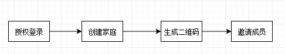
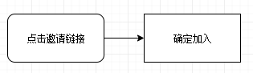

# 顾家 - 家庭类企业化管理，管理家庭相关事宜

family_oriented_project 1.0, 2.0：https://github.com/lidegejing/family_oriented_project

项目
---
该项目是基于微信云开发开发的微信小程序项目，项目主要由微信小程序 + 云数据库 + 云存储 + 云函数组成。  
  
### 背景  
家是一个情感的寄托，有家，我们就更能体会到家给我们带来的快乐，这种快乐促使我们在未来的道路上，在不同的城市里勇往直前，奋力拼搏。在这个大的前提下，我就在想能不能为家做一点我所擅长的事情，思来想去，结合日常工作上的经历，就想到了给家里做个管理软件，借此微信小程序提供的资源，于是就诞生了该项目。  

### 解决的实际问题
1. 家人之间的互帮互助
2. 家庭事项管理
3. 家庭报表
4. 成员管理
5. 家庭固有资产的管理

### 受众群体
任何一个家庭单元，均可对单元进行管理

### 主要操作流程
操作流程可分为家庭管理者、家庭成员。  
邀请成员：  
  
加入家庭：  


### 数据表结构
<font color=#9aa09d>[注]: 表结构中省略 _id、_openid 字段说明，默认为 string 类型，默认值默认为空，默认必填</font>  
<font color=#07c160>background_img(背景墙)</font> ：
属性|类型|默认值|必填|说明
:-|:-|:-|:-|:-
imgFileId||||云存储ID
imgSrc||||手机图片路径
userOpenId||||操作人ID
nickname||||操作人昵称

<font color=#07c160>bill_deatil(账单-项目)</font> ：
属性|类型|默认值|必填|说明
:-|:-|:-|:-|:-
familyID||||家庭ID
familyName|||x|家庭名称
xmmc||||项目名称
createDate||||创建日期
createUserID||||创建人ID
createUserName||||创建人昵称

<font color=#07c160>bill_member(账单-成员)</font> ：
属性|类型|默认值|必填|说明
:-|:-|:-|:-|:-
familyID||||家庭ID
familyName|||x|家庭名称
xm||||成员名称
createDate||||创建日期
createUserID||||创建人ID
createUserName||||创建人昵称

<font color=#07c160>bill_write(账单)</font> ：
属性|类型|默认值|必填|说明
:-|:-|:-|:-|:-
familyID||||家庭ID
sqNameID||||收钱人ID
sqNameIndex||||收钱人下标
sqNameName||||收钱者
xmIndex||||项目下标
xmID||||项目ID
xmName|||x|项目名称
zjrIndex|||x|中间人下标
zjrNameID|||x|中间人ID
zjrName|||x|中间人名称
nameID||||出钱者ID
nameIndex||||出钱者下标
nameName||||出钱者
zcName||||收钱方式
zcIndex||||收钱方式下标
bankCode||||银行卡代码
bankcardType||||银行卡类型-英文
bankcardTypeName||||银行卡类型-中文
bankCard||||银行卡卡号
bankName||||银行卡名称
zcje||||赞助金额
selectDate|||x|需要赞助的日期
nickName|||x|创建人昵称
openid|||x|创建人ID
modifyDate|||x|修改日期
modifyOpenid|||x|修改人ID
modifyUser|||x|修改人昵称
isTop|boolean|false||是否置顶，true-置顶、false-不置顶
isComplete|boolean|false||是否办结，true-办结、false-不办结

<font color=#07c160>family_info(家庭信息)</font> ：
属性|类型|默认值|必填|说明
:-|:-|:-|:-|:-
name||||家庭名称
createDate|||x|创建日期
createDateTimestamp|||x|创建日期时间戳
createOpenid|||x|创建人ID
createUser|||x|创建人
createUserName|||x|创建人昵称
modifyDate|||x|修改日期
modifyOpenid|||x|修改人ID
modifyTimestamp|||x|修改日期时间戳
modifyUser|||x|修改人昵称

<font color=#07c160>inviation_user(被邀请人)</font> ：
属性|类型|默认值|必填|说明
:-|:-|:-|:-|:-
joinFamilyID||||家庭ID
joinFamilyName|||x|家庭名称
inviteeID||||被邀请人ID
inviteeName||||被邀请人昵称
inviterID||||邀请人ID
inviterName||||邀请人昵称
joinDate||||加入日期
joinTimestamp||||加入日期时间戳
code||||邀请码

<font color=#07c160>invitation_code(邀请码)</font> ：
属性|类型|默认值|必填|说明
:-|:-|:-|:-|:-
familyID||||家庭ID
familyName|||x|家庭名称
deadlineDays|number|1.0||邀请码有效期
tag||||邀请码标签
code||当前时间戳||邀请码
createDate|||x|创建日期
createDateTimestamp|||x|创建时间戳
createUser|||x|创建人昵称
modifyDate|||x|修改日期
modifyOpenid|||x|修改人ID
modifyTimestamp|||x|修改时间戳
modifyUser|||x|修改人昵称

<font color=#07c160>manage_member(家庭成员管理)</font> ：
属性|类型|默认值|必填|说明
:-|:-|:-|:-|:-
familyID||||家庭ID
familyName|||x|家庭名称
xm||||姓名
birth||||出生日期
age||||周岁
touxiang|||x|头像
phone|||x|手机
qq|||x|xQQ
wx|||x|微信
zw|||x|职位
dw|||x|单位
openid||||创建人ID
nickName||||创建人昵称
createDate||||创建日期

<font color=#07c160>publish_matter(发布-事项)</font> ：
属性|类型|默认值|必填|说明
:-|:-|:-|:-|:-
familyID||||家庭ID
familyName|||x|家庭名称
isTimeTask|boolean|false||是否定时任务
isWait|boolean|false||是否待办
isComplete|boolean|false||是否办结
isTop|boolean|false||是否置顶
isTopTime||||置顶时间
completeTime||||办结时间
completeUsearNickname||||办结人昵称
time||||时间
title||||标题
matterDate||||事项日期
createDate||||创建日期
openid||||创建人ID
nickName||||创建人昵称
matterGradeIndex||||等级下标
matterGradeName||||等级名称
typeIndex||||类型下标
typeName||||类型名称
bz|||x|备注
zxzIndex||||体检对象 / 主要执行者下标
zxzName||||体检对象 / 主要执行者名称
dd|||x|地点

### 文件结构

```shell
├─cloud                                // 云项目文件夹
│  ├─export                            // 导出
│  ├─getopenid                         // 获取用户的openid
│  ├─help                              // 云数据库相关操作
│  └─timer                             // 定时触发器
├─colorui                              // colorui 样式
│  └─components
├─config                               // 配置文件
├─images                               // 图片
├─pages
│  ├─home                              // 应用主模块
│  ├─housewifery
│  │  ├─index                          // 首页主模块
│  │  └─timer                          // 定时设置
│  ├─help                              // 帮衬模块
│  │  └─index
│  ├─login                             // 登录
│  ├─logs                              // 日志
│  ├─manage
│  │  ├─index                          // 管理主模块
│  │  ├─member                         // 成员管理
│  │  ├─rent
│  │  │  ├─home                        // 租赁管理主模块
│  │  │  ├─add_edit_detail_renter      // 增加租客信息
│  │  │  ├─rent_money                  // 房租收取
│  │  │  └─write_room                  // 房间信息登记
│  │  └─server                         // 服务
│  ├─my
│  │  ├─index                          // 我的主模块
│  │  ├─author_about                   // 作者
│  │  ├─background                     // 背景墙
│  │  ├─create_family                  // 创建家庭
│  │  ├─invitation_code                // 邀请码
│  │  └─server                         // 服务
│  └─publish
│      ├─index                         // 发布主模块
│      ├─bill                          // 赞助
│      ├─matter                        // 事项
│      ├─physical_examination          // 体检报告
│      ├─purchase                      // 采购
│      ├─server                        // 服务
│      ├─sponsor                       // 账单
│      └─timer_task                    // 定时任务
├─styles                               // 公共样式
└─utils                                // 工具
```
